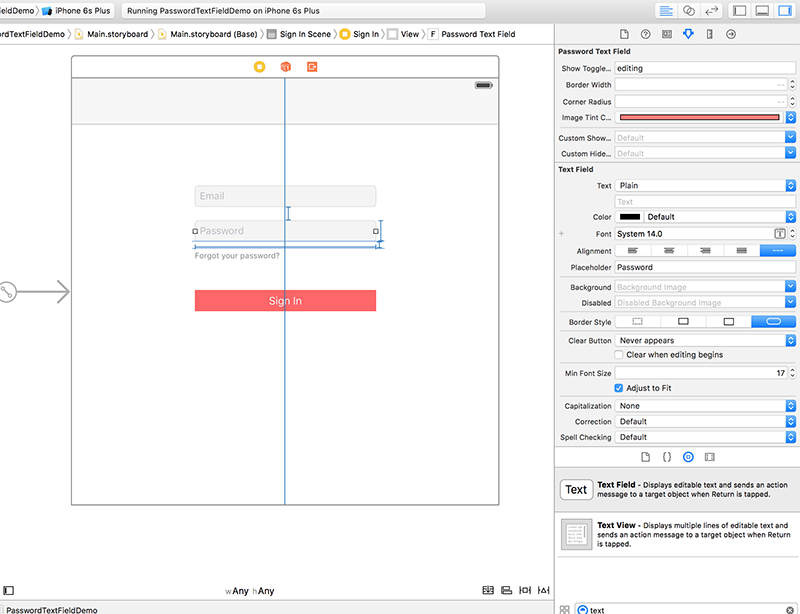

[](https://travis-ci.org/PiXeL16/PasswordTextField/) [](https://codecov.io/github/PiXeL16/PasswordTextField?branch=master) [](https://img.shields.io/cocoapods/v/PasswordTextField.svg) [](https://github.com/Carthage/Carthage)
[](https://github.com/matteocrippa/awesome-swift) [](https://raw.githubusercontent.com/PiXeL16/PasswordTextField/master/LICENSE)
[](https://swift.org)

# PasswordTextField
A custom TextField with a switchable icon which shows or hides the password and enforces good password policies,  written in `Swift`.


:star: Features
---
* Custom toggle icon in IB or programmatically.
* Custom icon color in IB or programmatically.
* Custom password validation rules.
* Custom password validation error message.
* Control when to show the icon, while editing, always or never.

:octocat: Installation
---

#### CocoaPods
You can use [CocoaPods](http://cocoapods.org/) to install `PasswordTextField` by adding it to your `Podfile`:

```ruby
platform :ios, '8.0'
use_frameworks!
pod 'PasswordTextField'
```

To get the full benefits import `PasswordTextField` wherever you import UIKit

``` swift
import UIKit
import PasswordTextField
```
#### Carthage
Create a `Cartfile` that lists the framework and run `carthage bootstrap`. Follow the [instructions](https://github.com/Carthage/Carthage#if-youre-building-for-ios) to add `$(SRCROOT)/Carthage/Build/iOS/PasswordTextField.framework` to an iOS project.

```
github "PiXeL16/PasswordTextField"
```

#### Manually
1. Download and drop ```/PasswordTextField``` folder  in your project.  
2. Congratulations!  

:metal: Usage
---
1. Open a storyboard or Xib file.
2. Drag and drop a `UITextField` to a ViewController.
3. In Identity Inspector, replace the class from `UITextField` to `PasswordTextField` and the module to `PasswordTextField`.
4. Configure your properties in the Attribute Inspector.



## Properties

| Property name | Data type | Remark |
| ------------- |:-------------:| ----- |
| Show Toggle Button While | String | Possible values are `editing`(default), `always`, `never` |
| Image Tint Color | UIColor | The color off the Toggle image, the functionality use `UIImageRenderingMode.AlwaysTemplate` to change the default or custom image color|
|Custom Show Secure Text Image| UIImage| Your custom image to show the secure text|
|Custom Hide Secure Text Image| UIImage| Your custom image to hide the secure text|

## Validation

`PasswordTextField` also provides functionality to enforce good password policies.

It will currently validate that the password format is `at least 8 characters long and contain one uppercase letter and one number`.

```swift
import PasswordTextField

if passwordTextField.isInvalid(){
  print(passwordTextField.errorMessage)
}
```

You can also provide your custom password validation format (with Regex) and error message:

```swift
import PasswordTextField

let validationRule = RegexRule(regex:"^[A-Z ]+$", errorMessage: "Password must contain only uppercase letters")

passwordTextField.validationRule = validationRule

if passwordTextField.isInvalid(){
  print(passwordTextField.errorMessage)
}
```

TODO
-----
* Show indication when password is strong or weak in TextField
* Animation when toggling Button


:alien: Author
------
Chris Jimenez - http://code.chrisjimenez.net, [@chrisjimeneznat](http://twitter.com/chrisjimeneznat)

:beer: Donate
------
If you want to buy me a beer, you can donate to my coin addresses below:
#### BTC
1BeGBew4CBdLgUSmvoyiU1LrM99GpkXgkj
#### ETH
0xa59a3793E3Cb5f3B1AdE6887783D225EDf67192d
#### LTC
Ld6FB3Tqjf6B8iz9Gn9sMr7BnowAjSUXaV

## License
`PasswordTextField` is released under the MIT license. See [LICENSE](https://github.com/pixel16/PasswordTextField/blob/master/LICENSE) for details.
